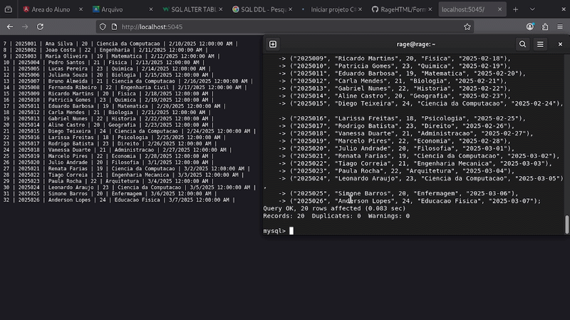

# Projeto de Integração SQL + ASP.NET com C#


[](https://www.linkedin.com/in/deyvid-martins/)

## Demonstração

Abaixo está uma demonstração da aplicação rodando e retornando os dados do banco de dados através da aplicação ASP.NET.



## Introdução

Este projeto foi desenvolvido como parte de um estudo prático sobre **bancos de dados relacionais utilizando SQL** e **desenvolvimento de aplicações web com C# e .NET**.

A proposta foi entender na prática como uma aplicação backend consegue **se comunicar com um banco de dados**, executar consultas SQL e retornar os resultados para uma aplicação web.

Durante o desenvolvimento, o foco foi compreender o funcionamento da integração entre aplicação e banco de dados, além de praticar conceitos importantes de programação backend.

---

## Objetivo do Projeto

O objetivo deste projeto é demonstrar, de forma simples e didática, como:

- Conectar uma aplicação desenvolvida em **C#** a um banco de dados **SQL**
- Executar consultas diretamente do backend
- Ler resultados retornados pelo banco de dados
- Exibir esses dados em uma aplicação web

Além disso, durante o desenvolvimento deste projeto foi possível aprender e praticar conceitos importantes como:

- Criação e organização de **classes em C#**
- Estruturação de métodos dentro de uma classe
- Estabelecimento de conexões entre uma aplicação e um banco de dados
- Execução de consultas SQL a partir de uma aplicação backend
- Leitura dinâmica de dados retornados pelo banco utilizando `DataReader`

Esses conceitos são fundamentais para o desenvolvimento de aplicações que precisam **interagir com bancos de dados relacionais**, algo muito comum em sistemas web.

---

## Database.cs

Essa parte foi responsável por criar a **estrutura de conexão com o banco de dados**.

Aqui eu criei uma classe chamada `Database`, que tem a função de centralizar a comunicação entre a aplicação em **C#** e o banco de dados **SQL**.

Dentro da classe existe uma variável chamada `connectionString`. Ela armazena os **parâmetros necessários para acessar o banco de dados**, como servidor, usuário, senha e o nome do banco.

O método `GetConnection()` é responsável por **criar e retornar uma conexão com o banco de dados**. Essa conexão será utilizada pelas outras partes do projeto sempre que for necessário executar comandos SQL.

```csharp
public class Database
{
    private String connectionString = "server=localhost;user=root;password=senha;database=name";

    public MySqlConnection GetConnection()
    {
        MySqlConnection connection = new MySqlConnection(connectionString);
        return connection;
    }
}